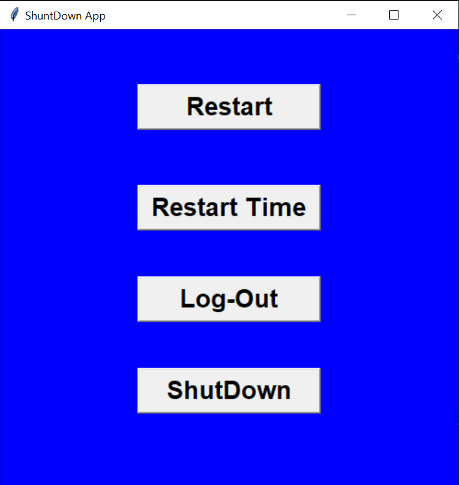

# Shutdown App using Python

A simple GUI-based Shutdown App built using Python and Tkinter.

## Features

- Restart Computer
- Restart with Timer
- Logout User
- Shutdown Computer

## Technologies Used

- Python
- Tkinter
- OS Module

## Screenshot



## How to Run

1. Install Python
2. Clone this repository

```bash
git clone https://github.com/your-username/shutdown-app-python.git
